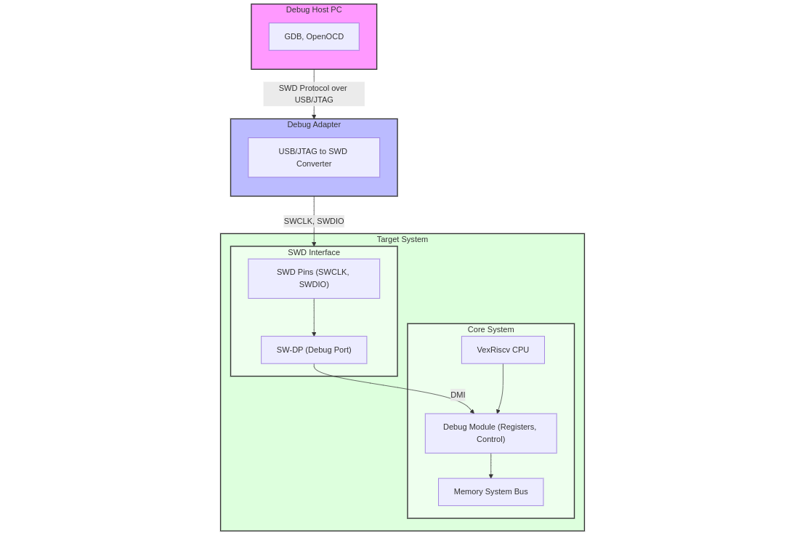

<h1 align="center">

<br>SWD Debug support in VexRiscv<br>
</h1>


## RISC-V ISA

RISC-V is an open standard instruction set architecture based on established RISC (Reduced Instruction Set Computer) principles.

Comparing to ARM and x86, a RISC-V CPU has the following advantages: 

- Free : RISC-V is open-source.
- Simple : RISC-V is much smaller than other commercial ISAs.
- Modular : RISC-V has a small standard base ISA, with multiple standard extensions.
- Stable : Base and first standard extensions are already frozen. There is no need to worry about major updates. 
- Extensibility : Specific functions can be added based on extensions. There are many more extensions are under development. 

### RISC-V Minimal Viable Debugger

To create a minimum viable debugger on a RISC-V Processor, you need the following capabilities:

*   **Memory Access**: The ability to **peek and poke** memory. This means reading from and writing to specific memory locations. Alternatively, the ability to push instructions (through the program buffer) can also suffice if direct memory access is not possible or is restricted.

*   **CPU Register Access**: The ability to **read and write CPU registers**. Registers are special storage locations within the CPU that are used for calculations, control, and status information.

*   **CPU Control**: The ability to **control the CPU**. This involves several key actions:
    *   **Halting the CPU**: Stopping the CPU's execution.
    *  **Single-stepping the CPU**: Executing one instruction at a time.
    *   **Resetting the CPU**: Restarting the CPU.
    *   **Setting Breakpoints**: Pausing the CPU when it reaches a certain instruction or memory location.

Here's a simplified diagram representing these core components:

```
     +---------------------+      +-----------------------+
     |    Debugger Host    |      |    Target Device      |
     +---------------------+      +-----------------------+
             |                           |
             |      (Debug Interface)    |
             v                           v
    +-----------------------+      +-----------------------+
    |   Memory Access      |----->| Memory                |
    |  (Read/Write)        |      |                       |
    +-----------------------+      +-----------------------+
             |                           |
             |                           |
    +-----------------------+      +-----------------------+
    | CPU Register Access  |----->| CPU Registers         |
    |  (Read/Write)        |      |                       |
    +-----------------------+      +-----------------------+
             |                           |
             |                           |
    +-----------------------+      +-----------------------+
    |   CPU Control         |----->| CPU (Halt, Step, etc.)|
    | (Halt, Step, Reset)   |      |                       |
    +-----------------------+      +-----------------------+
```

---

### Vexriscv Processor

VexRiscv is an FPGA-friendly CPU core that implements the RISC-V instruction set architecture (ISA). Designed with flexibility and scalability in mind, it caters to a wide range of applications, from compact microcontroller-based systems to more complex multi-core configurations. The project is open-source under the MIT license, promoting community collaboration and adaptation. 

VexRiscv is developed using SpinalHDL, a high-level hardware description language that enhances design modularity and reusability. This approach allows for a plugin-based architecture, enabling users to customize and extend the CPU's capabilities to meet specific project requirements.


### VexRiscv Current Debugging Status

The VexRiscv soft core supports minimal custom debugging by utilizing a debug plugin, which has two registers that allow for complete control of the CPU.

*   The **first register, Control Register** accessed at address zero, is a 32-bit register used to control the CPU. Through this register, it is possible to:
    *   Reset the CPU.
    *   Check if the CPU is halted.
    *   Single-step the CPU.
    *   Detect if the CPU has hit a breakpoint.

*   The **second Instruction Injection Port** is used to inject instructions into the CPU pipeline. By writing an instruction to this register, the CPU executes the instruction when it is paused.  The result of the instruction is then read from the same register. This allows for reading and writing to all of the CPU registers.
    *   For example, by injecting an instruction that moves a value from one register to another, the debugger can read the value of the source register by examining the destination register after execution.
    *   This same method can be used to construct memory addresses and write values to memory.

With these two registers, the core has all the necessary functions for a complete debugger, thus meeting the minimum requirements of a viable debugger.


### JTAG support in Vexriscv

JTAG stands for **Joint Test Action Group**. JTAG support in VexRiscv is implemented through a combination of hardware and software components that adhere to the JTAG standard (IEEE 1149.1).

The diagram  below describe how a host computer (with GDB) uses a JTAG interface to debug a VexRiscv CPU.

                                      +-----------------+
                                      |    GDB (Host PC)|
                                      +-------+---------+
                                              | (GDB remote target protocol)
                                              v
                                      +---------------+
                                      |   OpenOCD     |
                                      | (VexRiscv     |
                                      |   Driver)     |
                                      +-------+-------+
                                              | (JTAG transactions)
                                              v
        +----------+       +-----------------+    +-------------------+
        |  JTAG    | <---> |  JTAG Bridge    |--->|  VexRiscv Debug   |   
        |  Dongle  |       |(TAP, IR, DR,    |    |     Plugin        |
        |(TCK, TMS,|       |State Machine)   |    |(SystemDebugBus)   |
        |TDI, TDO) |       +-----------------+    +--------+----------+
        +----------+                                | (CPU Control, Registers)
                                                    |
                                                    v
                                       +--------------------------+
                                       |      VexRiscv CPU        |
                                       +--------------------------+

Debugging VexRiscv using JTAG involves connecting a JTAG dongle to the FPGA, and then using OpenOCD with a VexRiscv specific driver, to communicate with the JTAG bridge, which accesses the CPU debug module, all while GDB executes on the host machine.
A custom version of OpenOCD acts as the glue between GDB and the VexRiscv debug logic, handling the low-level JTAG communication.                                       

---

## Benefits of standardized Debugging

The VexRiscv CPU has its own specific debugging implementation that is not compatible with the [standard RISC-V Debug Specification](https://github.com/riscv/riscv-debug-spec). Current deviation from the ratified RISC-V debug specification is listed  below :

| Ratified Debug Spec Feature            | VexRiscv Support Status                                           |
| -------------------------------------- | ----------------------------------------------------------------- |
| Halt/Resume/Singlestep                 | ✅ Supported                                                      |
| Register (GPR/CSR) Read/Write          | ✅ Via instruction injection                                      |
| Memory Access via Abstract Commands    | ❌ Not standard; done via instruction injection                   |
| Hardware Breakpoints / Triggers        | ⚠️ Supports PC and load/store triggers, other modes not supported |
| Program Buffer                         | ✅ Supported                                                      |
| Multi-hart / Multi-DM support          | ⚠️ Unable to halt/resume multiple harts with a single command     |
| Alternate Transport Modules (non-JTAG) | ❌ Not implemented                                                |
| DM/DTM layer per spec                  | ❌ Partial; custom version used, need to extend to supprt SWD     |

Other than above features , below feature needs to be implemented :

- Support for other debug transport like SWD.

### SWD support in Vexriscv

SWD stands for **Serial Wire Debug**. The key differences between  JTAG and SWD are :

* SWD uses a two-wire interface (SWCLK and SWDIO) whereas JTAG uses four wires.
* SWD is generally faster than JTAG due to less overhead.

To add support for the RISC-V debug standard over SWD in VexRiscv below steps need to be followed:

#### 1. Debug Module (DM) Implementation:

* RISC-V debug standard DM handles all control operations regarding Halting and Resuming the CPU. Current implementation of Program Buffer in Vexriscv can probably handle this part.

#### 2. Debug Transport Module (DTM) Implementation:

* DTM is used  to handle the SWD protocol. It should provide access to the DM through the SWD interface by acting as a bridge between the SWD protocol and the DMI. 
* DTM needs to manage the communication with the DM, handling address and data transfers.

#### 3. Mapping the Debug Module Interface (DMI) Implementation:

* DMI is a bus used to communicate with the Debug Module, and it is mapped into the memory space.

##### Memory Access Methods

To be compliant, the implementation must have at least one of the memory access mechanisms: Program Buffer, Abstract Access Memory or System Bus Access (SBA).

- **Program Buffer**: VexRiscv supports  program buffer as specified in the RISC-V debug specification.
- **Abstract Access Memory**: VexRiscv doesn’t directly implement an abstract access memory command. Instead, it uses its instruction injection port to achieve similar functionality, allowing the debugger to execute any memory access instruction and thus access memory from the hart's perspective.
- **System Bus Access**: VexRiscv does not implement a separate system bus access block. The instruction injection mechanism is used to access memory and registers, which provides similar functionality but with instructions executed by the CPU. This means it cannot use this method to access memory while the CPU is running, as described in the RISC-V debug specification.

##### Register Access

- VexRiscv's debug implementation accesses CSRs by injecting RISC-V instructions to read or write to these registers.
- RISC-V debug specification states the Control and Status Registers (CSRs) are accessed using the abstract access register, by or-ing the register number with 0x1000. CSRs can also be accessed using the program buffer, if abstract access is not support

##### Control Register

-  VexRiscv uses a single, custom control register for debug control, while the RISC-V debug specification employs a more standardized and distributed approach with multiple control registers.

#### 4. SWD Implementation:

* Implement the SWD protocol, which involves sending data, address, and control bits over the two SWD wires. It's similar to JTAG in terms of functionality but uses fewer wires and is faster.
* The DTM will translate the SWD messages into the appropriate operations on the DMI.

#### 5. Software Support:

* Create a GDB server that can communicate with the DTM over the SWD interface. This server would use the standard RISC-V debug commands.

* Tools like OpenOCD or probe-rs can be used as a basis for the GDB server, given that they support RISC-V debug specification. Currently a custom version of OpenOCD works with VexRiscv.


The following conceptual diagram explains the general components and data flow involved in debugging via SWD:



In the diagram:
* The Debug Host PC runs debugging software such as GDB and OpenOCD.
* The Debug Transport Module converts the USB/JTAG interface to SWD, communicating with the target system through the SWCLK and SWDIO pins.
* The SW-DP (Debug Port) handles the SWD protocol and provides access to the Debug Module.
* The Debug Module provides access to the CPU's registers, controls the CPU execution, and provides access to system memory via the system bus.
* The VexRiscv CPU and the Memory System are debugged through this interface.

## Breakdown of Tasks

Below is the structured **breakdown of tasks** with **estimated effort** .


## **1. Refactor/Extend DebugPlugin**
**Goal:** Align VexRiscv CPU-side debug logic to the RISC-V Debug Spec.

**Tasks:**
- Add proper halt/resume state machine semantics.
- Integrate with DM-driven execution (via Program Buffer or injection).
- Extend CSR / GPR access mechanisms.
- Implement minimal correct triggers.

**Effort:** **30 person-days**

---

## **2. Implement/Refine DTM + JTAG TAP**
**Goal:** Make the transport layer spec-compliant.

**Tasks:**
- Implement DTM state machine + DMI registers.
- Correct `dtmcs`, abits, idle cycles.
- Ensure correct TAP IR/DR layout.
- Connect DTM to DM.

**Effort:** **30 person-days**

---

## **3. SWD Debug Transport Implementation**
**Goal:** Add Serial Wire Debug support alongside JTAG.

**Tasks:**
- Implement SWD protocol state machine.
- Design SWD-DTM bridging to DMI.
- Integrate with existing DM.
- Provide SWD pinout and SoC-level wiring.
- Add SWD support in OpenOCD/probe-rs configs.

**Effort: 30 person-days**

## **4. System Integration into SoC**
**Goal:** Integrate the new debug architecture into the top-level FPGA/System design.

**Tasks:**
- Update SoC top-level to expose JTAG pins.
- Integrate clock domains for debug.
- Update synthesis/P&R configs.

**Effort:** **15 person-days**

---

## **5. Toolchain Integration (OpenOCD / GDB)**
**Goal:** Fully debug the system using OpenOCD + GDB.

**Tasks:**
- Prepare OpenOCD configuration file.
- Validate DTM/DM operation (halt, step, resume).
- Validate register/memory access.
- Validate breakpoints.
- Optionally extend QEMU model for CI.

**Effort:** **15 person-days**

---

## **6. Verification & Test Infrastructure**
**Goal:** Ensure the entire debug pipeline behaves predictably.

**Tasks:**
- Build simulation testbenches for DTM→DM→CPU.
- Create automated JTAG test sequences.
- Test edge cases (EBREAK behavior, resume from exceptions).
- Regression tests.

**Effort:** **15 person-days**

---

## **7. Documentation & Developer Interface**
**Goal:** Make integration/usage clear for future development.

**Tasks:**
- Write internal documentation.
- Write user-facing “How to debug VexRiscv” guide.
- Comment key code sections.

**Effort:** **15 person-days**

---

## **8. Multi-Hart & Advanced Features**
**Goal:** Add support for multiple cores and advanced triggers.

**Tasks:**
- Implement multi-hart DM support.
- Implement advanced trigger types.
- Integrate with OpenOCD multi-hart operations.
- Extend test suite.

**Effort:** **30 person-days**

---

## ** Total Estimated Effort**

Equivalent to **180 person-days** .

---
