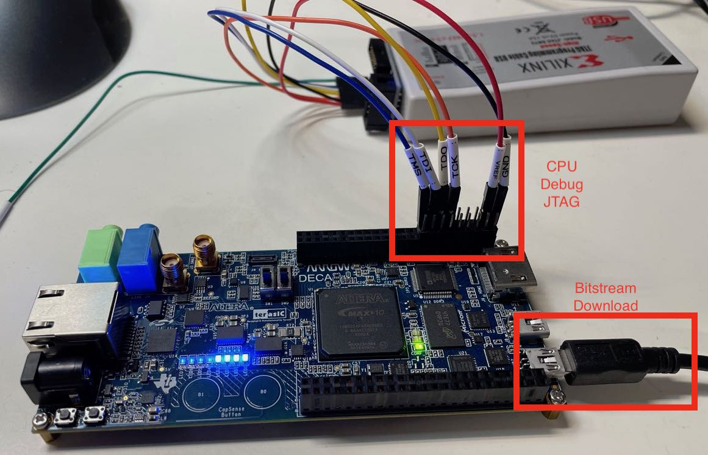
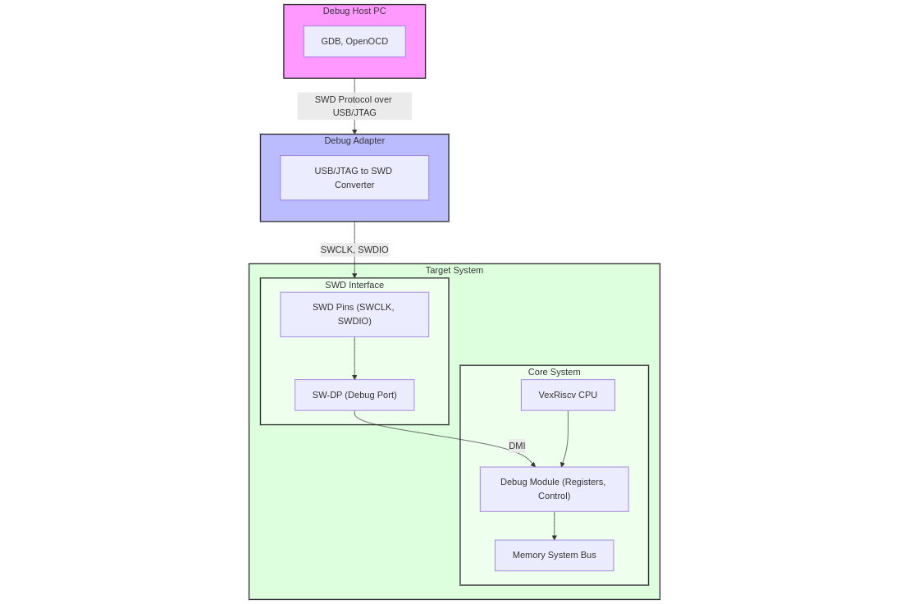

<h1 align="center">

<br>SWD Debug support in VexRiscv<br>
</h1>

# RISC-V Debug Support 

## RISC-V ISA

RISC-V is an open standard instruction set architecture based on established RISC (Reduced Instruction Set Computer) principles.

Comparing to ARM and x86, a RISC-V CPU has the following advantages: 

- Free : RISC-V is open-source.
- Simple : RISC-V is much smaller than other commercial ISAs.
- Modular : RISC-V has a small standard base ISA, with multiple standard extensions.
- Stable : Base and first standard extensions are already frozen. There is no need to worry about major updates. 
- Extensibility : Specific functions can be added based on extensions. There are many more extensions are under development. 

---

### RISC-V Minimal Viable Debugger

To create a minimum viable debugger on a RISC-V Processor, you need the following capabilities:

*   **Memory Access**: The ability to **peek and poke** memory. This means reading from and writing to specific memory locations. Alternatively, the ability to push instructions (through the program buffer) can also suffice if direct memory access is not possible or is restricted.

*   **CPU Register Access**: The ability to **read and write CPU registers**. Registers are special storage locations within the CPU that are used for calculations, control, and status information.

*   **CPU Control**: The ability to **control the CPU**. This involves several key actions:
    *   **Halting the CPU**: Stopping the CPU's execution.
    *  **Single-stepping the CPU**: Executing one instruction at a time.
    *   **Resetting the CPU**: Restarting the CPU.
    *   **Setting Breakpoints**: Pausing the CPU when it reaches a certain instruction or memory location.

Here's a simplified diagram representing these core components:

```
     +---------------------+      +-----------------------+
     |    Debugger Host    |      |    Target Device      |
     +---------------------+      +-----------------------+
             |                           |
             |      (Debug Interface)    |
             v                           v
    +-----------------------+      +-----------------------+
    |   Memory Access       |----->| Memory                |
    |  (Read/Write)         |      |                       |
    +-----------------------+      +-----------------------+
             |                           |
             |                           |
    +-----------------------+      +-----------------------+
    | CPU Register Access   |----->| CPU Registers         |
    |  (Read/Write)         |      |                       |
    +-----------------------+      +-----------------------+
             |                           |
             |                           |
    +-----------------------+      +-----------------------+
    |   CPU Control         |----->| CPU (Halt, Step, etc.)|
    | (Halt, Step, Reset)   |      |                       |
    +-----------------------+      +-----------------------+
```

---

### Vexriscv Processor

VexRiscv is an FPGA-friendly CPU core that implements the RISC-V instruction set architecture (ISA). Designed with flexibility and scalability in mind, it caters to a wide range of applications, from compact microcontroller-based systems to more complex multi-core configurations. The project is open-source under the MIT license, promoting community collaboration and adaptation. 

VexRiscv is developed using SpinalHDL, a high-level hardware description language that enhances design modularity and reusability. This approach allows for a plugin-based architecture, enabling users to customize and extend the CPU's capabilities to meet specific project requirements.


#### JTAG support in Vexriscv

JTAG stands for **Joint Test Action Group**. JTAG support in VexRiscv is implemented through a combination of hardware and software components that adhere to the JTAG standard (IEEE 1149.1).

The diagram  below describe how a host computer (with GDB) uses a JTAG interface to debug a VexRiscv CPU.

```

+-----------------+
|  GDB (Host PC)  |
+-------+---------+
        |
        v
+-----------------+     +--------------------+
|   OpenOCD       | --> |  JTAG Dongle       |
|(VexRiscv Driver)|     | (Jtag Uart Cable)  |
|   (Host PC)     |     |(TCK, TMS, TDI, TDO)|
+-----------------+     |                    |
                        +--------------------+
                                  |
                                  v
                    +--------------------------------------------------------------+
                    |                     Target                                   |
                    |    +-----------------+    +-------------------+              |
                    |    |  JTAG Bridge    |--->|  VexRiscv Debug   |              |
                    |    |(TAP, IR, DR,    |    |     Plugin        |              |
                    |    |State Machine)   |    |(SystemDebugBus)   |              |
                    |    +-----------------+    +--------+----------+              |
                    |                                | (CPU Control, Registers)    |
                    |                                v                             |
                    |                     +--------------------------+             |
                    |                     |      VexRiscv CPU        |             |
                    |                     +--------------------------+             |
                    +--------------------------------------------------------------+

```

Debugging VexRiscv using JTAG involves connecting a JTAG dongle to the FPGA, and then using OpenOCD with a VexRiscv specific driver, to communicate with the JTAG bridge, which accesses the CPU debug module, all while GDB executes on the host machine.
                                     
##### Host Setup

Terminal 1 on Host :
```                                              
  openocd -f interface/ftdi/olimex-jtag-tiny.cfg -f target/riscv.cfg
```

Terminal 2 on Host :
```
  riscv32-unknown-elf-gdb hello.elf
  (gdb) target remote :3333
  (gdb) load
  (gdb) break main
  (gdb) continue
  (gdb) info registers
  (gdb) next
  (gdb) print message
  (gdb) x/16x 0x80000000

```

##### Target Setup

<h1 align="center">

</h1>

---

#### VexRiscv Current Debugging Status

The VexRiscv soft core supports minimal custom debugging by utilizing a debug plugin, which has two registers that allow for complete control of the CPU.

*   The **first register, Control Register** accessed at address zero, is a 32-bit register used to control the CPU. Through this register, it is possible to:
    *   Reset the CPU.
    *   Check if the CPU is halted.
    *   Single-step the CPU.
    *   Detect if the CPU has hit a breakpoint.

*   The **second Instruction Injection Port** is used to inject instructions into the CPU pipeline. By writing an instruction to this register, the CPU executes the instruction when it is paused.  The result of the instruction is then read from the same register. This allows for reading and writing to all of the CPU registers.
    *   For example, by injecting an instruction that moves a value from one register to another, the debugger can read the value of the source register by examining the destination register after execution.
    *   This same method can be used to construct memory addresses and write values to memory.

With these two registers, the core has all the necessary functions for a complete debugger, thus meeting the minimum requirements of a viable debugger.


---

## Deviation from Standardized Debugging

The VexRiscv CPU has its own specific debugging implementation that is not compatible with the [standard RISC-V Debug Specification](https://github.com/riscv/riscv-debug-spec) (v1.0.0-rc4). Current deviation from the ratified RISC-V debug specification is listed below :


 Current deviation from the ratified RISC-V debug specification is listed  below :

| Ratified Debug Spec Feature            | VexRiscv Support Status                                           |
| -------------------------------------- | ----------------------------------------------------------------- |
| Halt/Resume/Singlestep                 | ✅ Supported                                                      |
| Register (GPR/CSR) Read/Write          | ✅ Via instruction injection                                      |
| Memory Access via Abstract Commands    | ❌ Not standard; done via instruction injection                   |
| Hardware Breakpoints / Triggers        | ⚠️ Supports PC and load/store triggers, other modes not supported |
| Program Buffer                         | ✅ Supported                                                      |
| Multi-hart / Multi-DM support          | ⚠️ Unable to halt/resume multiple harts with a single command     |
| Alternate Transport Modules (non-JTAG) | ❌ Not implemented                                                |
| DM/DTM layer per spec                  | ❌ Partial; custom version used, need to extend to supprt SWD     |

Other than above features , below feature needs to be implemented :

- Support for other debug transport like **SWD**.

---

### SWD support in Vexriscv

SWD stands for **Serial Wire Debug**. The key differences between  JTAG and SWD are :

* SWD uses a two-wire interface (SWCLK and SWDIO) whereas JTAG uses four wires.
* SWD is generally faster than JTAG due to less overhead.

The following conceptual diagram explains the general components and data flow involved in debugging via SWD:



In the diagram:
* The Debug Host PC runs debugging software such as GDB and OpenOCD.
* The Debug Transport Module (DTM) converts the USB/JTAG interface to SWD, communicating with the target system through the SWCLK and SWDIO pins.
* The SW-DP (Debug Port) handles the SWD protocol and provides access to the Debug Module(DM).
* The Debug Module(DM) provides access to the CPU's registers, controls the CPU execution, and provides access to system memory via the system bus.
* The VexRiscv CPU and the Memory System are debugged through this interface.


To add support for the RISC-V debug standard over SWD in VexRiscv below steps need to be followed:

#### 1. Debug Module (DM) Implementation:

* RISC-V debug standard DM handles all control operations regarding Halting and Resuming the CPU.

#### 2. Debug Transport Module (DTM) Implementation:

* DTM is used  to handle the SWD protocol. It should provide access to the DM through the SWD interface by acting as a bridge between the SWD protocol and the DMI. 
* DTM needs to manage the communication with the DM, handling address and data transfers.

#### 3. Mapping the Debug Module Interface (DMI) Implementation:

* DMI is a bus used to communicate with the Debug Module, and it is mapped into the memory space.


---

## Breakdown of Tasks

### **1. Implement Standard Debug spec in Vexriscv**
**Goal:** Replace proprietary implementation with spec compliant implementation.

**Approach:** Build a new `DebugModulePlugin` alongside the existing `DebugPlugin.scala` (which remains as a fallback). The existing plugin's register interface has zero overlap with the spec, so extending it is not viable. The useful pieces (~50 lines of halt/step/RVC handling) will be extracted and reused.

**Suggested File Structure:**
```
src/main/scala/vexriscv/plugin/
  DebugPlugin.scala            ← KEEP (existing, for backward compat)
  DebugModulePlugin.scala      ← NEW: DM registers, abstract commands
  DebugTransportPlugin.scala   ← NEW: JTAG DTM with standard dtmcs/dmi
  DebugCsrPlugin.scala         ← NEW: dcsr, dpc, dscratch CSRs on hart
  TriggerPlugin.scala          ← NEW: tselect, tdata1/2/3, tinfo, tcontrol
```

**Dependency Chain:**
```
Phase 1A: JTAG DTM + DMI Bus           ← Foundation, no dependencies
    │
    ▼
Phase 1B: Core DM (dmcontrol/dmstatus)  ← Needs DMI bus
    │
    ▼
Phase 1C: Abstract Register Access      ← Needs DM registers
    │
    ├──▼
    │  Phase 1D: Debug CSRs (dcsr/dpc)   ← Needs register access
    │      │
    │      ▼
    │  Phase 1F: Trigger Module           ← Needs dcsr for cause reporting
    │
    └──▼
       Phase 1E: Memory Access            ← Needs abstract command framework
```
#### GDB Capability per Phase for Hello World Debugging

| Phase | Milestone | GDB Capabilities | What Can be Verified |
|---|---|---|---|
| **1A** | DTM + DMI bus | JTAG chain detected, nothing else | JTAG connectivity |
| **1B** | DM control | Halt, resume, reset | Hello world UART output starts/stops with halt/resume |
| **1C** | Register access | Read/write all GPRs and CSRs | See PC, SP, arguments; identify which function is executing |
| **1D** | Debug CSRs | Single-step, halt cause, debug mode | Step through instructions one at a time; see why hart halted |
| **1E** | **Memory access** | **Full debug: load, break, step, print, backtrace, memory** | **Complete hello world debug session** (software breakpoints) |
| **1F** | Triggers | Hardware breakpoints, data watchpoints | Breakpoints on ROM/flash; watch variable changes |

Phases 1A-1D are incremental milestones that let you validate each layer before building the next.
**Phase 1E is the target for a complete hello world debugging experience with mainstream OpenOCD + GDB.** 

Detailed tasks and milestines planned for each Phase can be found [here](https://saketsinha.de/standard-debug-vexriscv).

---


## **2. SWD Debug Transport Implementation**
**Goal:** Add Serial Wire Debug support alongside JTAG.

**Tasks:**
- [ ] Implement SWD protocol state machine (SWCLK/SWDIO two-wire interface)
- [ ] Design SWD-DTM bridging to DMI to translate the SWD messages into the appropriate operations on the DMI
- [ ] Integrate with standard DM (from Task 1)
- [ ] Provide SWD pinout and SoC-level wiring
- [ ] Add SWD support in OpenOCD/probe-rs configs


---

## **3. System Integration into SoC**
**Goal:** Integrate the new debug architecture into the top-level FPGA/System design.

**Tasks:**
- [ ] Update SoC top-level to expose standard JTAG pins (TCK/TMS/TDI/TDO/TRST)
- [ ] Integrate clock domains for debug (debug clock vs. system clock)
- [ ] Update synthesis/P&R configs
- [ ] Wire DM to hart debug signals (halt request, resume ack, etc.)
- [ ] Wire SBA port to system bus (if implementing System Bus Access)

---


## **4. Verification & Test Infrastructure**
**Goal:** Ensure the entire debug pipeline behaves per spec.

**Tasks:**
- [ ] Build simulation testbenches for DTM→DMI→DM→CPU path
- [ ] Create automated JTAG test sequences for DMI operations
- [ ] Test `dmactive` activation/deactivation sequence
- [ ] Test abstract command error handling (all 7 `cmderr` codes)
- [ ] Test EBREAK behavior with `dcsr.ebreakm`/`ebreaks`/`ebreaku` combinations
- [ ] Test single-step across privilege mode transitions
- [ ] Test trigger module: each trigger type, chaining, `dmode` security
- [ ] Test System Bus Access error handling (if implemented)
- [ ] Test authentication mechanism (if implemented)
- [ ] Regression tests for all implemented features

---

## **5. Documentation & Developer Interface**
**Goal:** Make integration/usage clear for future development.

**Tasks:**
- [ ] Write internal architecture documentation (DM/DTM/Trigger block diagrams)
- [ ] Write user-facing “How to debug VexRiscv” guide (using standard OpenOCD)
- [ ] Document which optional spec features are implemented
- [ ] Document WARL field legal values for each register
- [ ] Comment key code sections in new DM/DTM implementation

---

## **6. Multi-Hart & Advanced Features (Optional)**
**Goal:** Add support for multiple cores and advanced features.

**Tasks:**
- [ ] Implement multi-hart DM support (`hartsel`, `hasel`, hart arrays)
- [ ] Implement halt/resume groups via `dmcs2`
- [ ] Implement `haltsum0-3` for efficient multi-hart halt polling
- [ ] Implement DM chaining via `nextdm` for multiple DMs
- [ ] Implement advanced trigger types (`itrigger`, `etrigger`, `tmexttrigger`)
- [ ] Implement trigger context matching (`mcontext`/`scontext`/`hcontext`)
- [ ] Integrate with OpenOCD multi-hart operations
- [ ] Extend test suite for multi-hart scenarios

---
